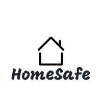

# HomeSafe

## Problem statement

The purpose of this project is to settle home insurance claims on-chain, in a decentralized and global manner via a crowd sourcing pool of funds. This removes the need for centralized entities that must always go through a due diligence process in order to determine if the insurance claim is legitimate. This process can be time consuming and in many cases can lead to the rejection of the claim itself.

HomeSafe is a home insurance protocol that settles claims on-chain by substituting any intermediary parties with home automation systems in order to achieve consensus. A variety of home automation systems already exist that provide a variety of features and help the owner gain insight on the state of the home such as smart home alarm systems, thermostats, air quality sensors, humidity sensors etc.

The HomeSafe protocol can leverage the output of these sensors and determine when an insurance claim is valid and proceed with finalizing the payment to the user. The claim amount is determined from the size of the pool, the type of insurance the user has and the current stake of the user in the pool. The claim amount is also affected by the total number of claims the user has done in the past.

_This project was part of the Virtual Chainlink Hackathon Spring 2021_
